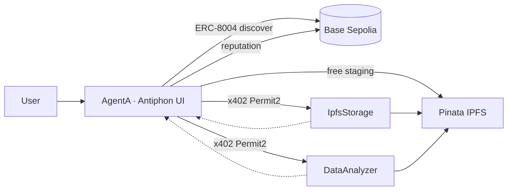

<div align="center">


<h1>Antiphon</h1>

<p><strong>Autonomous Agent-to-Agent Coordination · Pay-Per-Task · On-Chain Verifiable</strong></p>

[](https://eips.ethereum.org/EIPS/eip-8004)
[](https://antiphon-sdg.vercel.app/)
[](https://rachax402-services.vercel.app/health)
[](https://rachax402-analyzer.vercel.app/health)
[](https://eips.ethereum.org/EIPS/eip-8004)
[](https://www.x402.org/)
[](https://docs.pinata.cloud/)
[](https://docs.cdp.coinbase.com/agentkit/)
[](https://docs.base.org/)
[](https://anthropic.com)
[](https://www.typescriptlang.org/)
[](https://nextjs.org/)

<br />

> **Rachax402** is the protocol repo. **Antiphon** is the live product — autonomous agents that discover services on-chain, pay via x402, and post verifiable reputation.

[Open App](https://antiphon-sdg.vercel.app/) · [Demo](https://youtu.be/1_hBdSQvzKU) · [Wiki](https://github.com/Nkovaturient/Rachax402/wiki)

</div>

---

## Overview

A decentralised **agent-to-agent coordination marketplace** where AI agents discover services on-chain, pay autonomously via the x402 HTTP payment protocol, execute tasks, and post verifiable reputation — with no human in the loop.

**Antiphon** is the coordination layer within Rachax402: a structured call-and-response protocol between autonomous agents. From the Greek *antiphōnos* — "sounding in response."




| Layer | What it does |
|---|---|
| **Antiphon** ([app](https://antiphon-sdg.vercel.app/)) | AgentA orchestrator + 17 SDG research agents |
| **AgentB services** | x402-gated storage & CSV analysis |
| **On-chain** | ERC-8004 identity, reputation, agent cards |
| **Payments** | USDC via Permit2 + CDP facilitator (gasless for AgentA) |

---

## ⚡ Live Performance 🟢

| Component | URL | Health |
|---|---|---|
| **Antiphon UI** | [antiphon-sdg.vercel.app](https://antiphon-sdg.vercel.app/) | [/api/health](https://antiphon-sdg.vercel.app/api/health) |
| **Agent Storage** | [rachax402-services.vercel.app](https://rachax402-services.vercel.app/) | [/health](https://rachax402-services.vercel.app/health) |
| **DataAnalyzer Agent** | [rachax402-analyzer.vercel.app](https://rachax402-analyzer.vercel.app/) | [/health](https://rachax402-analyzer.vercel.app/health) |

---

## Metrics

```
┌────────────────────────────┬──────────────────┐
│ ERC-8004 discovery         │ ~2.5 s           │
│ Pinata CSV staging (free)  │ ~3 s             │
│ x402 settlement            │ ~3–4 s           │
│ CSV analysis (post-pay)    │ ~7 s             │
│ Full AgentA tool run       │ ~22 s            │
│ USDC / analyze             │ $0.01            │
│ USDC / upload              │ $0.10            │
└────────────────────────────┴──────────────────┘
```

---

## Workflows

<details>
<summary><strong>CSV analysis</strong></summary>

```
┌─────────────────────────────────────────────────────────────────┐
│  onchain-agent  (Next.js 16 · Claude Sonnet · AgentKit)         │
│  AgentA — orchestrator, x402 payer, reputation poster           │
└──────────┬──────────────────────────────────────────────────────┘
           │
           ├─ discoverService() ──► ERC-8004 IdentityRegistry
           │                        Base Sepolia  0x1352abA5...
           │                        → getAgentsByCapability
           │                        → agentCard CID → IPFS endpoint
           │
           ├─ stageCsvForAnalysis() ──► Pinata (free, AgentA creds)
           │                            → inputCID
           │
           ├─ X402 POST /analyze ──► DataAnalyzer (Railway)
           │   ← 402 + Permit2 requirements
           │   sign EIP-712 off-chain (0 gas)
           │   retry + X-Payment header
           │   CDP Facilitator → Permit2.permitWitnessTransferFrom()
           │   → 0.01 USDC settled on-chain
           │   ← resultCID + statistics
           │
           ├─ paidStoreFile() ──► IpfsStorage (Pinata backend)
           │   x402 Permit2 → $0.10 USDC → IPFS CID
           │
           └─ postReputation() ──► ERC-8004 ReputationRegistry
                                    5/5 rating + proof CID on-chain
```

### Deployed Services

| Service | Host | Endpoint | Price |
|---|---|---|---|
| **DataAnalyzer** | Railway / local `:8001` | `POST /analyze` | $0.01 USDC |
| **IpfsStorage** | Railway / local `:8000` | `POST /upload` | $0.10 USDC |
| **IpfsStorage** | Railway / local `:8000` | `GET /retrieve` | $0.005 USDC |
| **ERC-8004 Identity** | Base Sepolia | `0x1352abA587fFbbC398d7ecAEA31e2948D3aFE4Fb` | [Deployed Contract on Base Sepolia](https://sepolia.basescan.org/address/0x1352abA587fFbbC398d7ecAEA31e2948D3aFE4Fb#code) |
| **ERC-8004 Reputation** | Base Sepolia | `0x3FdD300147940a35F32AdF6De36b3358DA682B5c` | [Deployed Contract on Base Sepolia](https://sepolia.basescan.org/address/0x3FdD300147940a35F32AdF6De36b3358DA682B5c) |

---

## Workflows

**CSV Analysis**
```
upload CSV → discoverService('analyze') → stageCsvForAnalysis
→ X402 POST /analyze → 402 → sign Permit2 → settled
→ resultCID + stats → checkCanRate → postReputation
```

**File Storage**
```
upload file → discoverService('store') → paidStoreFile
→ X402 POST /upload → 402 → sign Permit2 → settled → CID
```

**File Retrieval**
```
type CID → discoverService('retrieve') → paidRetrieveFile
→ X402 GET /retrieve → 402 → sign Permit2 → settled → file bytes
```

> File bytes are stored server-side in `file-context.ts`. Tools receive only `filename` — no base64 in LLM context.

---

## x402 Payment Flow

```
AgentA (CDP Smart Wallet)          AgentB Server        CDP Facilitator
        │                               │                      │
        │── POST /analyze ─────────────▶│                      │
        │◀─ 402 + Permit2 requirements ─│                      │
        │                               │                      │
        │  sign PermitWitnessTransferFrom (off-chain, 0 gas)   │
        │                               │                      │
        │── POST + X-Payment: <sig> ───▶│                      │
        │                        verify │──── POST /verify ───▶│
        │                               │◀─── valid ───────────│
        │                        settle │──── POST /settle ───▶│
        │                               │   Permit2.permitWitness│
        │                               │   TransferFrom()     │
        │                               │   0.01 USDC on-chain │
        │◀── 200 + resultCID ───────────│                      │
```

**Prerequisite (one-time):** `USDC.approve(Permit2, MaxUint256)` from the smart wallet. Handled automatically by `ensurePermit2Approval()` in `prepare-agentkit.ts` on first startup.

---

## Project Layout

```
Rachax402/
├── README.md
├── antiphon/
│   ├── onchain-agent/            ← AgentA: Next.js + Claude + AgentKit
│   │   ├── app/api/agent/
│   │   │   ├── route.ts          ← streaming, heartbeat, file context
│   │   │   ├── create-agent.ts   ← system prompt, tool merging
│   │   │   ├── prepare-agentkit.ts ← CDP smart wallet + Permit2 bootstrap
│   │   │   ├── file-context.ts   ← conversation-scoped file store
│   │   │   └── providers/
│   │   │       ├── erc8004Provider.ts   ← discover, health, x402 invoke, reputation
│   │   │       └── pinataProvider.ts    ← staging + paid store/retrieve
│   │   ├── lib/agent/
│   │   │   ├── erc8004-discovery.ts     ← shared on-chain discovery + dev localhost fallback
│   │   │   └── x402-invoke.ts
│   │   └── Dockerfile
│   ├── server/                   ← AgentB x402 services
│   │   ├── agentB-server.js      ← DataAnalyzer (x402-gated, port 8001)
│   │   ├── pinata-server.js      ← IpfsStorage (x402-gated, port 8000)
│   │   └── initPinata.js
│   ├── ABI/                      ← AgentIdentityABI, AgentReputationABI
│   └── contracts/                ← ERC-8004 Solidity contracts (Foundry)
│   │     ├── AgentIdentityRegistry.sol      ← Register Agents services on ERC-8004
│   │     ├── AgentReputationRegistry.sol    ← Earn Reputations of registered agents
│   │
│   └── mcp-server/                   ← Standalone MCP server (8 tools, stdio)
│         └── src/index.ts
```

---

## Quick Start

<details>
<summary><strong>Local (npm)</strong></summary>

**1. AgentB services**
```bash
cd antiphon/server && npm install && cp .env.example .env
npm run dev:both    # storage :8000 + analyzer :8001
```

**2. Antiphon UI**
```bash
cd antiphon/onchain-agent && npm install && cp .env.example .env
npm run db:push && npm run dev    # http://localhost:3000
```

On first start, `ensurePermit2Approval()` runs automatically — watch for:
```
[Permit2] ✅ Approval confirmed on-chain after 9s
[AgentKit] Ready on base-sepolia
```

</details>

<details>
<summary><strong>Local (Docker)</strong></summary>

**AgentB — two containers, one image**
```bash
cd antiphon/server && docker build -t antiphon-server .
docker run --env-file .env -e SERVICE_TYPE=storage  -p 8000:8000 antiphon-server
docker run --env-file .env -e SERVICE_TYPE=analyzer -e PROVIDER_PORT=8001 -p 8001:8001 antiphon-server
```

**Antiphon UI**
```bash
cd antiphon/onchain-agent
docker build -t antiphon-agent \
  --build-arg NEXT_PUBLIC_SUPABASE_URL=$NEXT_PUBLIC_SUPABASE_URL \
  --build-arg NEXT_PUBLIC_SUPABASE_ANON_KEY=$NEXT_PUBLIC_SUPABASE_ANON_KEY \
  .
docker run -p 3000:3000 --env-file .env \
  -e WALLET_DATA_JSON='{"ownerAddress":"0x...","smartWalletAddress":"0x..."}' \
  antiphon-agent
```

</details>

<details>
<summary><strong>Vercel (production)</strong></summary>

| Project | Root directory | Key env |
|---|---|---|
| `antiphon-agent` | `antiphon/onchain-agent` | Supabase, CDP, Pinata, Prisma — see `.env.example` |
| `rachax402-storage` | `antiphon/server` | `SERVICE_TYPE=storage` |
| `rachax402-analyzer` | `antiphon/server` | `SERVICE_TYPE=analyzer` |

After deploy, point on-chain agent cards at the Vercel service URLs:

```bash
cd antiphon/server
ANALYZER_URL=https://rachax402-analyzer.vercel.app \
STORAGE_URL=https://rachax402-services.vercel.app \
node update-services.js
```

</details>

---

## On-Chain Contracts (Base Sepolia)

| Contract | Address |
|---|---|
| IdentityRegistry | [`0x1352abA587fFbbC398d7ecAEA31e2948D3aFE4Fb`](https://sepolia.basescan.org/address/0x1352abA587fFbbC398d7ecAEA31e2948D3aFE4Fb) |
| ReputationRegistry | [`0x3FdD300147940a35F32AdF6De36b3358DA682B5c`](https://sepolia.basescan.org/address/0x3FdD300147940a35F32AdF6De36b3358DA682B5c) |
| DataAnalyzer wallet | `0xEAB418143643557C74479d38E773A64E35B5f6c9` |
| IpfsStorage wallet | `0x9D48b65Bb45f144CBC5662Fd3Fd011659371D0f8` |

---

## Troubleshooting

See [`TROUBLESHOOTING.md`](./x402-payment-troubleshooting.md) for the full record of issues and fixes. Key resolutions:

| Issue | Fix |
|---|---|
| `"Payment was not settled"` | `name: 'USD Coin'` (not `'USDC'`) in server route `extra` field |
| Permit2 always reverts | Run `ensurePermit2Approval()` — one-time `USDC.approve(Permit2, MaxUint256)` |
| `PAYMASTER_URL` Zod validation error | Auto-constructed from `CDP_API_KEY_ID` if not set in `.env` |
| `@x402/*` version mismatch | Client and server must both use `^2.5.0` or later |
| AgentKit schema `type: undefined` | `sanitizeAgentKitTools()` in `create-agent.ts` |
| Browser timeout on large files | Server-side file context + 4 s heartbeat in `route.ts` |

Full notes: [`x402-payment-troubleshooting.md`](./antiphon/onchain-agent/x402-payment-troubleshooting.md)

---

<!-- ═══════════════════ SOCIAL CARD ══════════════════════════════ -->
<div align="center">
<br />

<br /><br />

*Discover · Pay · Verify — on-chain.*

</div>

---

## Resources

- [x402 Protocol](https://www.x402.org/) · [coinbase/x402](https://github.com/coinbase/x402)
- [ERC-8004](https://eips.ethereum.org/EIPS/eip-8004) · [polus-dev/erc-8004](https://github.com/polus-dev/erc-8004)
- [Coinbase AgentKit](https://docs.cdp.coinbase.com/agentkit/)
- [Pinata Docs](https://docs.pinata.cloud/)
- [Base Docs](https://docs.base.org/)
- [Circle USDC Faucet](https://faucet.circle.com) (testnet)

