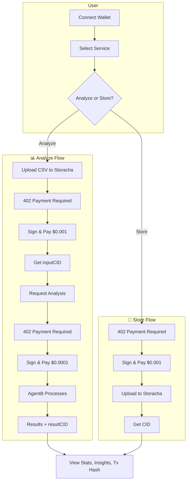

# Rachax402 AI Agent Coordination System: Powered by Storacha


**Pay-per-use AI agent marketplace** — upload files, run CSV analysis, or store on IPFS. All gated by x402 micropayments on Base Sepolia.

---

## What It Demonstrates

| Feature | Description |
|--------|-------------|
| **CSV Analysis** | Upload CSV → pay $0.0001 → get stats, insights, outlier detection |
| **File Storage** | Upload any file → pay $0.001 → get IPFS CID via Storacha |
| **x402 Payments** | Sign EIP-712 authorization → facilitator settles USDC on-chain |
| **Wallet Connect** | RainbowKit + wagmi for Base Sepolia |
| **Tx Verification** | Real settlement tx hash from `PAYMENT-RESPONSE` header |

---

## Backend Services

| Service | Port | Role |
|---------|------|------|
| **Storacha Storage** | `8000` | Upload/retrieve files on IPFS ($0.001/upload) |
| **AgentB Data Analyzer** | `8001` | CSV stats, numerical analysis ($0.0001/analysis) |

Both use x402 middleware: 402 → sign → retry with payment → settle on-chain.

---

## Frontend Flow



---

## Quick Start

```bash
pnpm install
pnpm dev
```

**Prerequisites:** Storacha server (`:8000`) and AgentB server (`:8001`) running. See `../server/README.md`.

---

## Stack

- **UI:** React, Tailwind, Radix, Framer Motion
- **Web3:** wagmi, RainbowKit, viem
- **Payments:** @x402/core, @x402/evm (EIP-712 signing)
- **State:** Zustand
