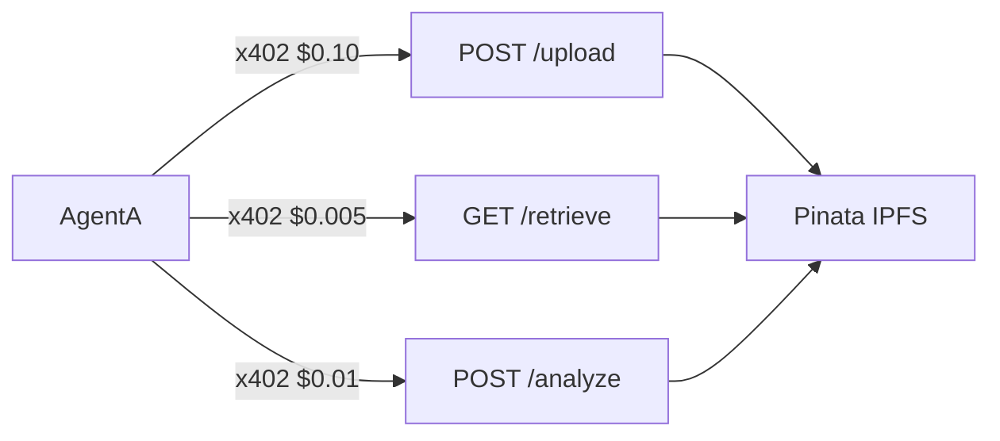

# Antiphon — AgentB Services

[](https://rachax402-services.vercel.app/health) [](https://rachax402-analyzer.vercel.app/health) [](https://www.x402.org/) [](https://docs.pinata.cloud/) [](https://expressjs.com/)

> x402 payment-gated **DataAnalyzer** + **IpfsStorage** (Pinata backend). Discovered by AgentA via ERC-8004 on Base Sepolia.

---

## Services



| Service | File | Live URL | Price |
|---|---|---|---|
| **IpfsStorage** | `pinata-server.js` | [rachax402-services.vercel.app](https://rachax402-services.vercel.app/) | $0.10 upload · $0.005 retrieve |
| **DataAnalyzer** | `agentB-server.js` | [rachax402-analyzer.vercel.app](https://rachax402-analyzer.vercel.app/) | $0.01 / CSV |

```bash
curl https://rachax402-services.vercel.app/health
curl https://rachax402-analyzer.vercel.app/health
```

---

## Quick start

<details>
<summary><strong>npm (local)</strong></summary>

```bash
npm install && cp .env.example .env

npm run dev          # storage only  → :8000
npm run dev:agent    # analyzer only → :8001
npm run dev:both     # both (concurrently — dev only)
```

</details>

<details>
<summary><strong>Docker</strong></summary>

One image, two modes via `SERVICE_TYPE`:

```bash
docker build -t antiphon-server .

docker run --env-file .env -e SERVICE_TYPE=storage \
  -p 8000:8000 antiphon-server

docker run --env-file .env -e SERVICE_TYPE=analyzer \
  -e PROVIDER_PORT=8001 -p 8001:8001 antiphon-server
```

> Docker runs `node` directly — not `npm start` / `dev:both`.

</details>

<details>
<summary><strong>Vercel (production)</strong></summary>

Deploy **two Vercel projects** from this directory:

| Project | `SERVICE_TYPE` | Key env |
|---|---|---|
| `rachax402-storage` | `storage` | `PORT`, `RECIPIENT_ADDRESS`, `PINATA_JWT` |
| `rachax402-analyzer` | `analyzer` | `PROVIDER_PORT`, `PROVIDER_WALLET_ADDRESS`, `PINATA_JWT` |

| Vercel setting | Value |
|---|---|
| Framework | Other |
| Build / Output | leave empty |
| Entry | `vercel.json` → `api/index.js` |

Shared: `FACILITATOR_URL`, `X402_NETWORK`, optional `CDP_API_KEY_*`. See `.env.example`.

</details>

---

## Environment

```bash
cp .env.example .env
```

| Variable | Storage | Analyzer |
|---|---|---|
| `SERVICE_TYPE` | `storage` | `analyzer` |
| `RECIPIENT_ADDRESS` | ✓ | — |
| `PROVIDER_WALLET_ADDRESS` | — | ✓ |
| `PINATA_JWT` | ✓ | ✓ |
| `PINATA_GATEWAY` | ✓ | ✓ |
| `FACILITATOR_URL` | ✓ | ✓ |
| `X402_NETWORK` | ✓ | ✓ |

---

## API

| Method | Path | Price | Body |
|---|---|---|---|
| `POST` | `/upload` | $0.10 | `multipart/form-data` file |
| `GET` | `/retrieve?cid=` | $0.005 | — |
| `POST` | `/analyze` | $0.01 | `{ inputCID, requirements }` |
| `GET` | `/health` | free | — |

All paid routes return `402` first → client signs Permit2 → retries with `X-Payment`.

---

## On-chain discovery

AgentA has **no hardcoded service URLs** in production:

```
discoverService('analyze')
  → ERC-8004 getAgentsByCapability
  → agentCard CID on IPFS
  → { endpoint: "https://rachax402-analyzer.vercel.app/analyze" }
  → x402 fetchWithPayment
```

After changing deploy URLs:

```bash
ANALYZER_URL=https://rachax402-analyzer.vercel.app \
STORAGE_URL=https://rachax402-services.vercel.app \
node update-services.js
```

---

## Troubleshooting

| Error | Fix |
|---|---|
| `sh: concurrently: not found` | Docker CMD must call `node` directly, not `npm start` |
| `Cannot find module 'papaparse'` | Add `papaparse` to `dependencies` (not devDependencies) |
| `RECIPIENT_ADDRESS is undefined` | Set the env var in Railway Variables panel |
| `402` but payment fails | Wallet needs test USDC — faucet: https://faucet.circle.com |
| Analyzer 502 or SIGTERM on Railway | See **Railway PORT vs PROVIDER_PORT** below |
| Storacha upload fails | Delegation must include `upload/add` and `space/blob/add` |

**Railway PORT vs PROVIDER_PORT** — Railway injects `PORT` and routes traffic (and health checks) to it. The analyzer must listen on `PORT` when set. In code we use `PORT || PROVIDER_PORT || 8001`: on Railway the app binds to Railway’s `PORT`, so 502 and health-check SIGTERM go away. You can leave `PROVIDER_PORT` in Railway config; it’s only used when `PORT` is unset (e.g. local dev).

## 🌐 Going to Mainnet

1. Change network to `eip155:8453` (Base mainnet)
2. Update `RECIPIENT_ADDRESS` to your mainnet wallet
3. Ensure wallet has USDC for gas
4. Test thoroughly first!

## 📚 More Info

- [x402 Docs](https://x402.gitbook.io/x402) - Protocol docs
- [Storacha Docs](https://docs.storacha.network) - Storage docs
- [Bazaar Discovery](https://x402.gitbook.io/x402/core-concepts/bazaar-discovery-layer) - Discovery layer

---

Built with ❤️ using x402 + Storacha